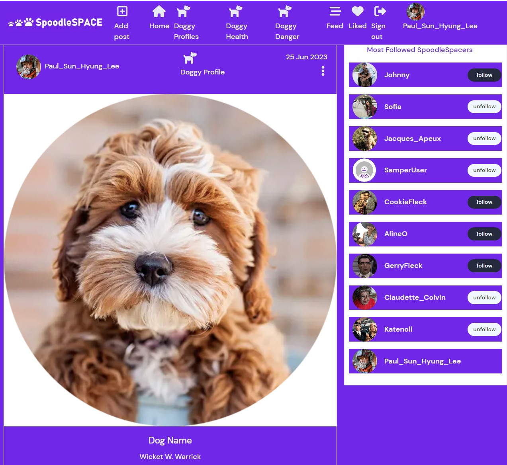
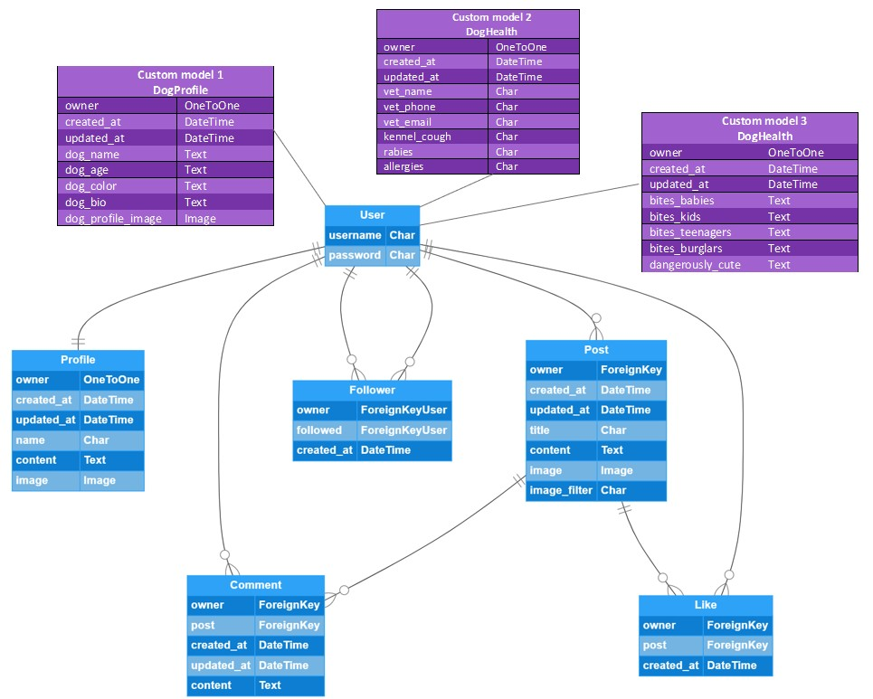
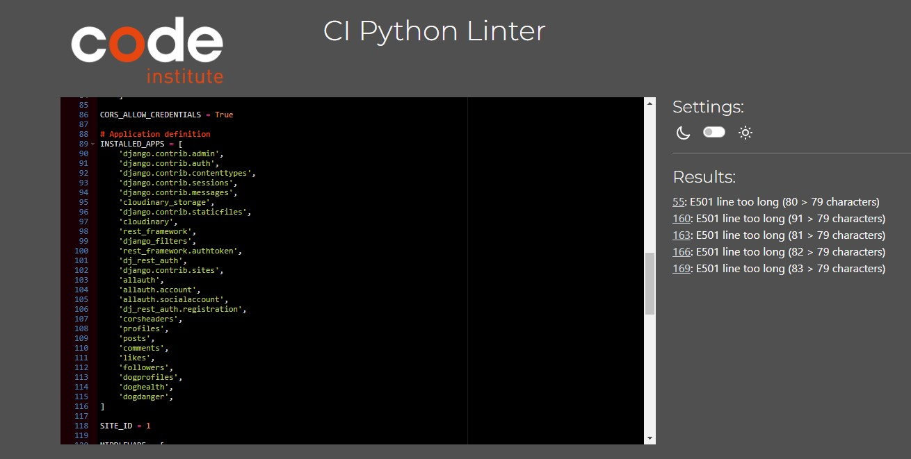

# SpoodleSpace–Backend

[**SpoodleSpace**](https://spoodle-space-pp5.herokuapp.com) is a Django REST Framework API that powers the frontend React app, delivering a full social platform for Cockapoo dog owners and enthusiasts.

Originally inspired by [Cockapoo Club](https://home-cockapoo-club-pp4.herokuapp.com), this project expands the idea into a more engaging, interactive, and scalable experience using **HTML**, **CSS**, **JavaScript**, **Python**, **React**, **Bootstrap**, and **Django REST Framework**.

- 🔗 **[Deployed site](https://spoodlespace.herokuapp.com/)**
- 💻 **[Frontend GitHub repo](https://github.com/SamOBrienOlinger/spoodle-space-pp5)**

---
> 🚧 **Site is Available on Desktop, but Temporarily Unavailable on Mobile Devices. This is due a necessary Database Migration as a result of ElephantSQL's End of Life. The website has since been moved to Heroku's PostgreSQL database service**  
>
---

## Summary

This social platform allows users to connect, share photographs, and exchange information about caring for Cockapoos — one of Ireland’s most beloved dog breeds.

Unlike typical social networks, this project fosters a shared identity and belonging within a niche community. It is designed to attract:

- Families, couples, or individuals who already own Cockapoos.
- People seeking guidance on training, health, or behaviour.
- Potential owners researching the breed.
- Owners wanting to share photos, stories, and adventures.
- Anyone looking for peer support from fellow dog lovers.

The backend plays a critical role in linking frontend components and ensuring smooth user experiences.

---

## Contents

- [User Stories](#user-stories)
- [Entity Relationship Diagram](#entity-relationship-diagram)
- [Technologies](#technologies)
- [Testing](#testing)
- [Deployment](#deployment)
- [Credits](#credits)

---

## User Stories

### Navigation and Authentication

- Users can access a navigation bar on all pages.
- Users can sign up, log in, and stay logged in using JWT.
- Users can tell whether they're logged in and view avatars.
- Conditional rendering: signed-in vs. signed-out views.

### Profile Features

- View other users' profiles.
- See most followed profiles.
- View profile stats: post count, followers, etc.
- Follow/unfollow users.
- Update username and password.

### Posts, Likes, and Comments

- Create, view, edit, and delete posts.
- Like/unlike posts.
- Comment on posts, view timestamps, and edit/delete comments.
- Infinite scrolling for all post lists.

### Dog Profile

- Add and edit your dog's profile and photo.
- View recent and searchable dog profiles.
- View others’ dog profiles (if following).

### Dog Health

- Add/edit your dog’s health info.
- View recent health details.
- Keyword search and infinite scrolling.

### Dog Danger

- Add/edit information about how dangerous your dog is.
- View recent posts and search.
- Infinite scrolling enabled.

---

## Entity Relationship Diagram

- Built-in Django models were used with three custom models:

  - `DogProfile`
  - `DogHealth`
  - `DogDanger`

---

## Technologies

### Languages

- [Python](https://en.wikipedia.org/wiki/Python_(programming_language))

### Frameworks & Tools

- [Django](https://www.djangoproject.com/)
- [Django REST Framework](https://www.django-rest-framework.org/)
- [Git](https://git-scm.com/)
- [GitHub](https://github.com/)
- [PostgreSQL](https://www.postgresql.org/)
- [ElephantSQL](https://www.elephantsql.com/)
- [Heroku](https://heroku.com/)

---

## Testing

Manual testing was carried out to:

- Restrict user access to protected actions.
- Verify full CRUD functionality in the API.
- Validate user story outcomes.

Refer to `/testing.md` for backend testing details.  
User stories and acceptance criteria are tracked in [GitHub Projects](https://github.com/users/SamOBrienOlinger/projects/3).  
Frontend testing can be found in the [frontend repo README](https://github.com/SamOBrienOlinger/spoodle-space-pp5/blob/main/README.md) and [testing.md](https://github.com/SamOBrienOlinger/spoodle-space-pp5/blob/main/testing.md).

### Python Validation

The Code Institute's CI Python Linter was used to validate all Python code.  
All apps passed validation except for `E501` long line warnings:

---

## Fixed Bugs

Model changes caused database inconsistencies.  
A `ForeignKey` field was mistakenly used instead of `OneToOneField`, corrupting migrations.  
Resolution involved deleting the old ElephantSQL DB, creating a new one, and updating `env.py` and Heroku Config Vars.

---

## Deployment

### Original ElephantSQL Setup

1. Log in to ElephantSQL.
2. Create a new instance (`Tiny Turtle` plan).
3. Choose nearest region.
4. Review and create.
5. Copy the database URL.
6. Add it to Heroku config vars.

### Heroku Deployment

1. Log in to Heroku.
2. Create a new app.
3. Set region and app name.
4. Link GitHub repo under **Deploy** tab.
5. Install required packages (`psycopg2`, `dj-database-url`, etc.).
6. Configure JWT, CORS, allowed hosts, etc.
7. Ignore `env.py`.
8. Generate `requirements.txt`.
9. Click **Deploy Branch**.
10. After build, click **Open App**.

> ⚠️ The database is currently being migrated to Supabase.

---

## Credits

- [W3Schools](https://www.w3schools.com/)
- [Stack Overflow](https://stackoverflow.com/)
- Code Institute's [Moments Project](https://github.com/Code-Institute-Solutions/moments)
- [Tom Ainsworth](https://github.com/Tom-Ainsworth) – debugging support
- [README Template](https://github.com/Code-Institute-Solutions/readme-template) – structure inspiration
- Mentors: [Naoise Gaffney](https://github.com/NaoiseGaffney), [Antonio Rodriguez](#)
- CI [Student Care Team](https://learn.codeinstitute.net/ci_support/diplomainsoftwaredevelopmentadvancedfrontend/studentcare) and [Tutors](https://learn.codeinstitute.net/ci_support/specializationsamplecontent/troubleshooting)
