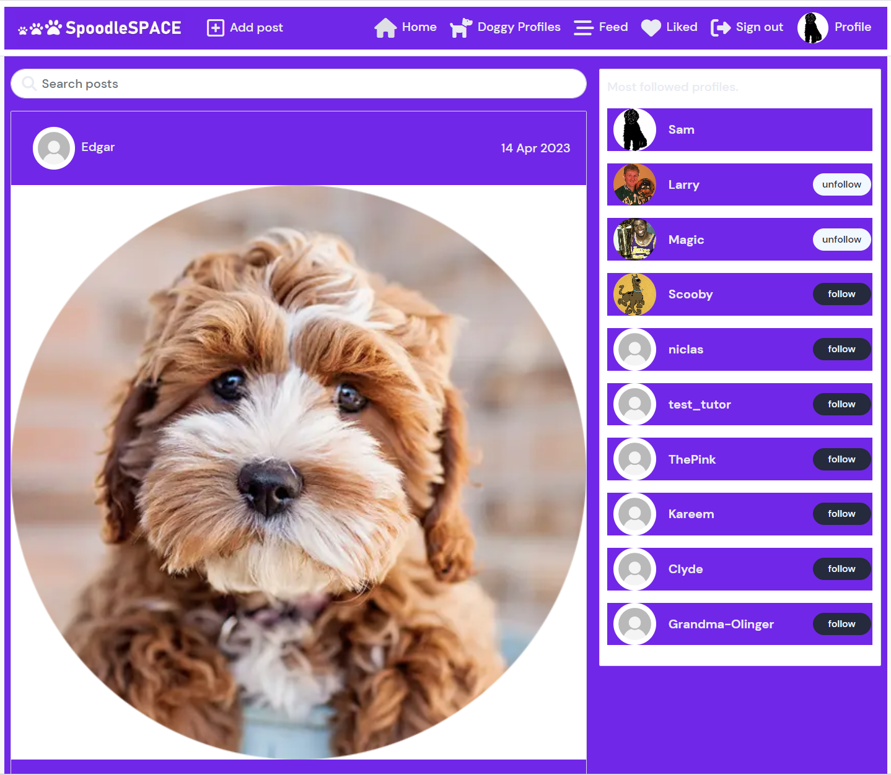

# 

**[SpoodleSpace](spoodlespace.herokuapp.com)** was developed and submmitted as my fifth Profile Portfolio Project as part of specializing in Advanced Front-end Development for the Code Institute's Diploma in full-stack software development course. Being the Django Rest Framework API, three custom models and forms were designed to interface with its React JavaScript framework and library. 

This project introduces a new range of features and funcionalities that offer Usersa valuable expansion on my previous Portfolio Projects, which centred on a fictional webiste for an online community of dog owners called 'Cockapoo Club'. The progress made in this iteration of the original concept which now includes HTML, CSS, JavaScript, React.js Bootstrap.js, and Django REST Framework. This project evolved out of ideas for delivering signifcant improvements and a fuller experience for Usersof the **[Cockapoo Club, Dublin Ireland](https://home-cockapoo-club-pp4.herokuapp.com)** website. 

- **[Click Here](https://spoodlespace.herokuapp.com/)** to see the deployed website. 

- To view the repository on Github **[Click Here](https://github.com/SamOBrienOlinger/drf-spoodle-space)**.

- This website was designed for Desktop Usersfirst and is responsive for Usersof smaller devices.  

## **Summary**
  This social platform provides Userswith an opportunity to connect and share photogpraphs, and even information about owning, training and taking care of a breed of dog called Cockapoos, one of Ireland's newest, most popular and much-loved dog breeds. 
  
  Unlike many other social media platforms that provide a similar expereince, this project offers Usersa unique way to create and participate in their own community of likeminded pet owners.    

The site targets Usersaround the world who:

* may already have a Cockapoo dog and need more information about taking care of their dog. 

* may be thinking about getting a new Cockapoo dog and require more information to make their decision. 

 * may already be Cockapoo owners and are interested in connecting with and learning from other Cockapoo owners. 

* will enjoy sharing photographs of their pets online.  
<!-- 
## **Contents**

  ### **Testing** -->

### **Technologies**

### Languages

-   [Python](https://en.wikipedia.org/wiki/Python_(programming_language))

### Frameworks, Libraries & Programs Used
  - [Django:](https://www.djangoproject.com/)

  - [Django Rest Frameworks](https://www.django-rest-framework.org/).

  - [Git:](https://git-scm.com/)

  - [GitHub:](https://github.com/)

  - [PostgreSQL:](https://www.postgresql.org/)

  - [ElephantSQL:](https://www.elephantsql.com/)

  - [Heroku:](https://heroku.com/)
  
 ### **Testing**
- All apps behaved as expected. 
- The three custom apps: **dogprofiles**, **doghealth** and **dogdanger** were tested with a focus on how well they integrated into the platform. The Code Institute's CI Python Linter was used to validate the Python code. Every app passed without errors, except for E501 'line too long' warnings. For example:

Manual testing was used throughout each stage of development to ensure the functionalities achieved the goals set out in the User Stories. 

### **Fixed Bugs**

  Migrated changes to models.py files caused the most problems. ALthough the data did exist in [Elephant SQL](https://www.elephantsql.com/), delete it entirely, create a new instances needed to be created and connect to the API. The env.py file and Heroku Config Vars had to be updated accordingly. This issue was caused by altering a model to have an owner = ForeignKey, when a OneToOneField was required. 

### **Deployment steps**
- set the following environment variables:
    - CLIENT_ORIGIN
    - CLOUDINARY_URL
    - DATABASE_URL
    - DISABLE_COLLECTSTATIC
    - SECRET_KEY
- install psycopg2 and dj-database-urlth libraries to handle database connection.
- configured dj-rest-auth library for JWTs
- set allowed hosts
- configured CORS:
	- set allowed_origins
- set default renderer to JSON
- add Procfile with release and web commands
- gitignore the env.py file
- generate requirements.txt
- deploye to Heroku

