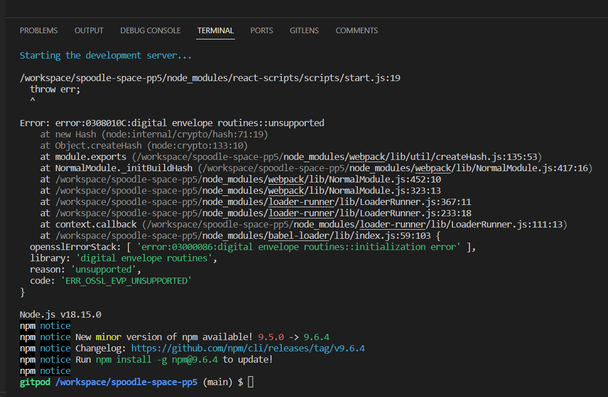
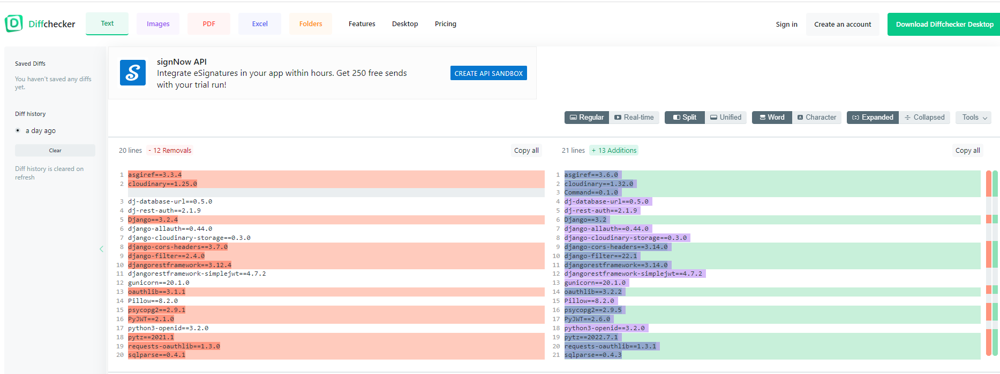
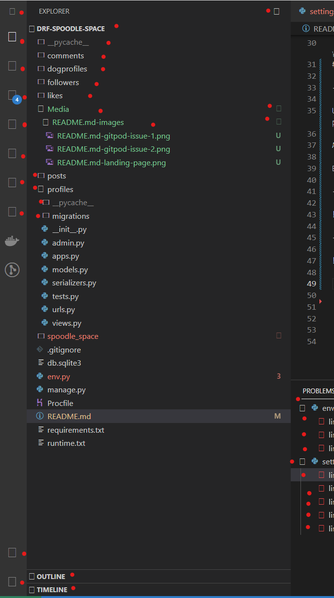
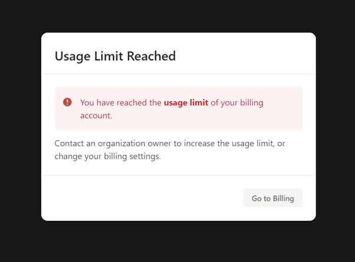
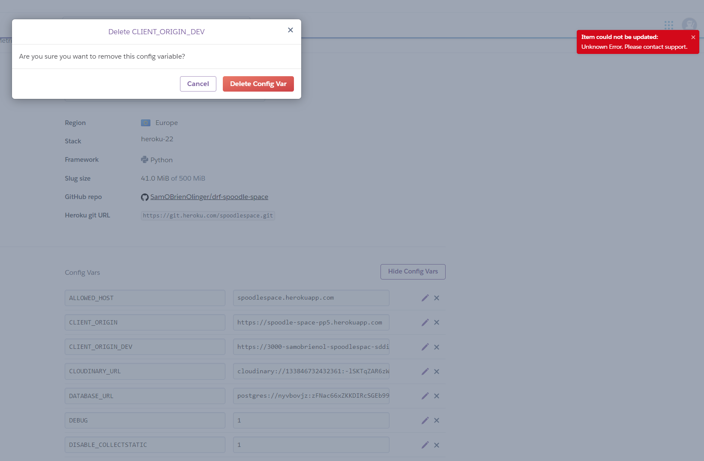
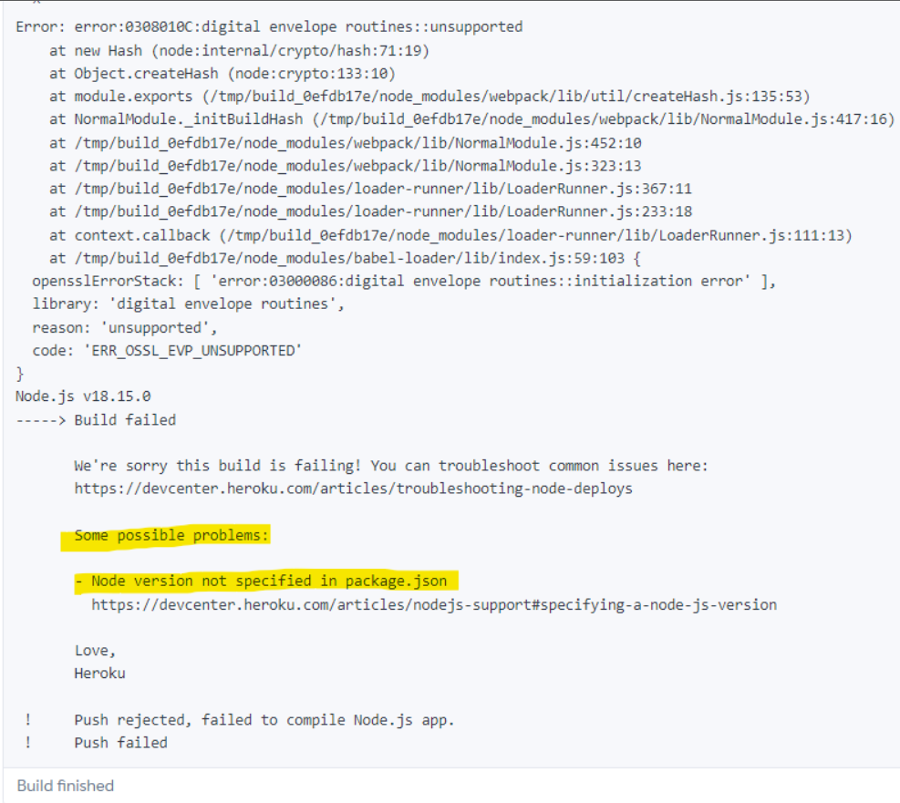

# 

**[SpoodleSpace](spoodlespace.herokuapp.com)** was developed and submmitted as my fifth Profile Portfolio Project as part of specializing in Advanced Front-end Development for the Code Institute's Diploma in full-stack software development course. 

This project introduces a new range of features and funcionalities that offer Users a valuable expansion on my previous Portfolio Projects, which centred on a fictional webiste for an online community of dog owners called 'Cockapoo Club'. The progress made in this iteration of the original concept which now includes HTML, CSS, JavaScript, React.js Bootstrap.js, and Django REST Framework. This project evolved out of ideas for delivering signifcant improvements and a fuller experience for Users of the **[Cockapoo Club, Dublin Ireland](https://home-cockapoo-club-pp4.herokuapp.com)** website. 

- **[Click Here](https://spoodlespace.herokuapp.com/)** to see the deployed website. 

- To view the repository on Github **[Click Here](https://github.com/SamOBrienOlinger/drf-spoodle-space)**.

- This website was designed for Desktop users first and is responsive for users of smaller devices.  

## **Summary**
  This social platform provides users with an opportunity to connect and share photogpraphs, and even information about owning, training and taking care of a breed of dog called Cockapoos, one of Ireland's newest, most popular and much-loved dog breeds. 
  
  Unlike many other social media platforms that provide a similar expereince, this project offers users a unique way to create and participate in their own community of likeminded pet owners.    

The site targets users around the world who:

* may already have a Cockapoo dog and need more information about taking care of their dog. 

* may be thinking about getting a new Cockapoo dog and require more information to make their decision. 

 * may already be Cockapoo owners and are interested in connecting with and learning from other Cockapoo owners. 

* will enjoy sharing photographs of their pets online.  

## **Contents**

- **Unfixed Bugs**

Unfortuantely, due to a range of unexpected errors and issues with both gitpod and Heroku, the overall negative impact has been that there was not enought time to fully implement all of the planned features and functionalites.  

Below are examples of just some of the many challenges faced throughout the development stages. 

- Gitpod Issue Example: installaion of Django 

- Gitpod Issue Example: incorrect versions in requirements.txt file

- Gitpod Issue Example: missing various features, most obviously icons to help users navigate the platform

- Gitpod Issue Example: usage limit exceeded

- Heroku Issue Example of errors preventing any editing, updating or deleting of Config Vars

- Heroku Issue Example of errors preventing deployment

