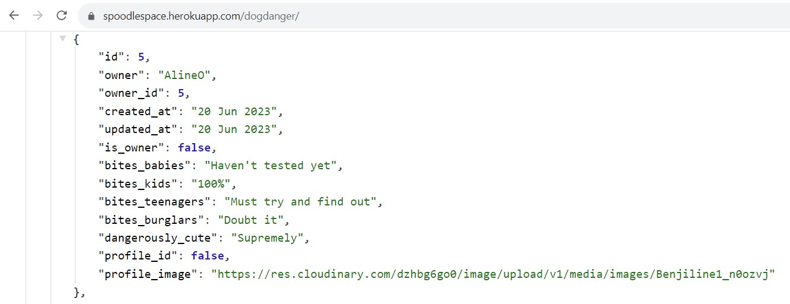

# SpoodleSpace - Backend

## **[drf-spoodle-space](spoodlespace.herokuapp.com)** was developed using Django and Django Rest Framework to serve as the API for **[SpoodleSpace](spoodle-space-pp5.herokuapp.com)**. 

# 
**SpoodleSpace** was developed and submitted as my fifth Profile Portfolio Project as part of specializing in Advanced Front-end Development for the Code Institute's Diploma in full-stack software development course. Being the Django Rest Framework API, three custom models and forms were designed to interface with its frontend React JavaScript library. 

This project evolved out of a previous Portfolio Project, which centred around a fictional online community of dog owners using a website called '**[Cockapoo Club](https://home-cockapoo-club-pp4.herokuapp.com)**'.

This iteration of the original concept introduces an entirely new range of features and functionalities. A main site goal for this project was to provide Users with a very different and more engaging interactive experience. 
This expansion on that original concept has allowed me to combine my understanding of **HTML**, **CSS**, **JavaScript**, **Python**, **React**, **Bootstrap**, and **Django REST Framework**. 

- **[Click Here](https://spoodlespace.herokuapp.com/)** to see the deployed website. 

- To view the frontend repository on Github **[Click Here](https://github.com/SamOBrienOlinger/spoodle-space-pp5)**. 

## **Summary**
  This social platform provides Users with an opportunity to connect and share photographs, and even information about owning, training and taking care of a breed of dog called Cockapoos, one of Ireland's newest, most popular and much-loved dog breeds. 
  
  Unlike many other social media platforms that provide a similar experience, this project offers Users a unique way to create and participate in their own community of likeminded pet owners.    

The site is designed to engage millions of potential Users around the world who:

* may already have a Cockapoo dog and need to learn about how to best take care of their dog. 

* may be thinking about getting a new Cockapoo dog and require more information to make their decision. 

 * may already be Cockapoo owners and are interested in connecting with and learning from other Cockapoo owners. 

* will enjoy sharing photographs and videos of their pets.  

In order to acheive the project's most important goals of enhancing both the UI and UX, how data is manipulated via the front-end application was of fundamental importance.

## Contents

- [User Stories](#user-stories)
- [Entity Relationship Diagram](#entity-relationship-diagram)
- [Technologies](#technologies)
- [Testing](#testing)
- [Deployment](#deployment)
- [Credits](#credits)

### [User Stories](#user-stories)

  **Navigation and authentication**

  - Navigation: As a user, I can view a navbar from every page so that I can navigate easily between pages.
  - Routing: As a user, I can navigate through pages quickly so that I can view content seamlessly without page refresh.
  - Authentication - Sign up: As a user, I can create a new account so that I can access all the features for signed-up users.
  - Authentication - Sign in: As a user, I can sign in to the app so that I can access functionality for logged-in users.
  - Authentication - Logged in Status: As a user, I can tell if I am logged in or not so that I can log in if I need to.
  - Authentication - Refreshing access tokens: As a user, I can maintain my logged-in status until I choose to log out so that my user experience is not compromised.
  - Navigation: Conditional rendering - As a logged-out user, I can see sign-in and sign-up options so that I can sign in/sign up.
  - Avatar: As a user, I can view users' avatars so that I can easily identify users of the application.

  **Profile**

  - Profile page: As a user, I can view other users' profiles so that I can see their posts and learn more about them.
  - Most followed profiles: As a user, I can see a list of the most followed profiles so that I can see which profiles are popular.
  - As a user, I can view data about other users, such as the number of posts, follows, and users followed so that I can learn more about them.
  - Follow/Unfollow a user: As a logged-in user, I can follow and unfollow other users so that I can see and remove posts by specific users in my posts feed.
  - View all posts by a specific user: As a user, I can view all the posts by a specific user so that I can catch up on their latest posts or decide I want to follow them.
  - Update username and password: As a logged-in user, I can update my username and password so that I can change my display name and keep my profile secure.

  **Posting, liking, and commenting on images**

  - Create posts: As a logged-in user, I can create posts with images.
  - View a post: As a user, I can view the details of a single post so that I can learn more about it.
  - Like a post: As a logged-in user, I can like a post so that I can show my support for the posts that interest me.
  - Post page: As a user, I can view the posts page so that I can read the comments about the post.
  - Edit post: As a post owner, I can edit my post title and description so that I can make corrections or update my post after it was created.
  - Create a comment: As a logged-in user, I can add comments to a post so that I can share my thoughts about the post.
  - Comment date: As a user, I can see how long ago a comment was made so that I know how old a comment is.
  - View comments: As a user, I can read comments on posts so that I can read what other users think about the posts.
  - Delete comments: As an owner of a comment, I can delete my comment so that I can control the removal of my comment from the application.
  - Edit a comment: As an owner of a comment, I can edit my comment so that I can fix or update my existing comment.

  **Dog profile**

  - As a logged-in user, I can create and edit my dog profile, including being able to add and change a picture of my dog and information about my dog.
  - As a logged-in user, I can view other users' dog profiles if I am following them.
  - As a user, I can view the most recent dog profiles posted, ordered by most recently created first so that I am up to date with the newest content.
  - As a user, I can search for dog profiles with keywords so that I can find the dog profiles and user profiles I am most interested in.
  - Infinite scroll: As a user, I can keep scrolling through the images on the site that are loaded for me automatically so that I don't have to click on "next page".

  **Dog health details**

  - As a logged-in user, I can create and edit health details about my dog.
  - As a logged-in user, I can view the health details of other users' dogs if I am following them.
  - As a user, I can view the most recent details about the health of users' dogs, ordered by most recently created first so that I am up to date with the newest content.
  - As a user, I can search for dog health details with keywords so that I can find the dog health details and user profiles I am most interested in.
  - Infinite scroll: As a user, I can keep scrolling through the images on the site that are loaded for me automatically so that I don't have to click on "next page".

  **Dog danger details**

  - As a logged-in user, I can create and edit details about how dangerous my dog is.
  - As a logged-in user, I can view the details of how dangerous other users' dogs are if I am following them.
  - As a user, I can view the most recent details posted about how dangerous other users' dogs are, ordered by most recently created first so that I am up to date with the newest content.
  - As a user, I can search for these details with keywords so that I can find the details and user profiles I am most interested in.
  - Infinite scroll: As a user, I can keep scrolling through the images on the site that are loaded for me automatically so that I don't have to click on "next page".

### [Entity Relationship Diagram](#entity-relationship-diagram)

- Built-in Django models were used for this project. 
  
- The three custom models created were:
  - DogProfile
  - DogHealth 
  - DogDanger
  

### [Technologies](#technologies)

- #### Languages

  -  [Python](https://en.wikipedia.org/wiki/Python_(programming_language))

- #### Frameworks, Libraries, Programs and Services Used
  - [Django:](https://www.djangoproject.com/)

  - [Django Rest Frameworks](https://www.django-rest-framework.org/).

  - [Git:](https://git-scm.com/)

  - [GitHub:](https://github.com/)

  - [PostgreSQL:](https://www.postgresql.org/)

  - [ElephantSQL:](https://www.elephantsql.com/)

  - [Heroku:](https://heroku.com/)
  
 ### [Testing](#testing)
- CRUD functionality across the website was tested manually to ensure that Users can work with data in the backend API.   
The three custom apps: **dogprofiles**, **doghealth** and **dogdanger** were tested with a focus on how well they integrated and interacted with the platform as a whole. The three custom forms, with validation, that allow users to create and edit resources in the back-end API. 

  Please see the **[frontend repository README.md file](https://github.com/SamOBrienOlinger/spoodle-space-pp5/blob/main/README.md)** for details of all manual testing that cover backend functionality

- Code Institute's CI Python Linter was used to validate all Python code. Every app passed without errors, except for E501 'line too long' warnings. For example:

Manual testing was used throughout each stage of development to ensure the functionalities achieved the goals set out in the User Stories. 

- Fixed Bugs

  Migrated changes to models.py files caused the most problems overall. Although the data did exist in [Elephant SQL](https://www.elephantsql.com/), teh databse was corrupted and had to be delete entirely. A new instances needed to be created and connect to the API. The env.py file and Heroku Config Vars had to be updated accordingly. This issue was caused by a migration that altered a model from having an owner = ForeignKey when a OneToOneField was required. 

### [Deployment](#deployment) 

This project was deployed through Heroku using the following steps:

- Log into Heroku
- Select 'Create New App' from your dashboard
- Choose an app name
- Select the appropriate region based on your location
- Click 'Create App'

- On your dashboard, click the 'Deploy' tab
- Locate 'Deployment Method' and choose 'GitHub'
- locate your repositorythen click 'Connect'

- Click the 'Settings' tab
- Open the 'Config Vars' and click 'Reveal Config Vars'
- The variables and their values need to be added, they can be found in your env.py file

- The following environment variables need to be matched in Heroku:
    - CLIENT_ORIGIN
    - CLOUDINARY_URL
    - DATABASE_URL
    - DISABLE_COLLECTSTATIC
    - SECRET_KEY

- install psycopg2 and dj-database-urlth libraries to handle database connection.
- configured dj-rest-auth library for JWTs
- set allowed hosts
- configured CORS:
	- set allowed_origins

- gitignore the env.py file
- generate a requirements.txt file

once all the variables are in place, choose the main branch and click 'Deploy Branch'.
Once the build is finished, click 'Open App' located at the top of the page. 

### [Credits](#credits)

  - [W3Schools](https://www.w3schools.com/) 
  - [Stack Overflow](https://stackoverflow.com/)
  - Code Institute's [Moments](https://github.com/Code-Institute-Solutions/moments) module.

  - Code Institute Alumnus [Tom Ainsworth](https://github.com/Tom-Ainsworth) was of great support at strategically important stages to tease out certain bugs.   

  - The [README template](https://github.com/Code-Institute-Solutions/readme-template) provided by Code Institute was very helpful as a model for developing this README file.  

  - My mentors, [Naoise Gaffney](https://github.com/NaoiseGaffney) and [Antonio Rodriguez](AntonioRodriguez_mentor), provided invaluable support and I learned a lot from them throughout the development of this project. 
  
  Last but certainly not least, are the Code Institute's [Student Care Team](https://learn.codeinstitute.net/ci_support/diplomainsoftwaredevelopmentadvancedfrontend/studentcare) and all the Tutors on the [Student Support Team](https://learn.codeinstitute.net/ci_support/specializationsamplecontent/troubleshooting). Regardless of the challenge faced, they have provided invaluable support to me in developing my skills, knowledge and experience. Thank you very much.
